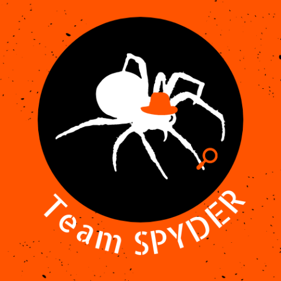

# definitely-lice-communism
A 2D game made by Team 4 of the UBC Game Development club (Team Spyder).

## Getting Started

To run the project,
1. Have exactly one of TestScene, MainMenu or Scene1 loaded
2. Play the scene

### Prerequisites

Unity Editor 2019.4.31f (download via Unity Hub), [git](http://git-scm.com), a C# IDE (e.g. [Visual Studio](https://visualstudio.microsoft.com), [JetBrains Rider](https://jetbrains.com/rider/); I'd personally recommend Rider).

Note that JetBrains Rider comes free with a student license (use your student email, such as xxxx@student.ubc.ca)